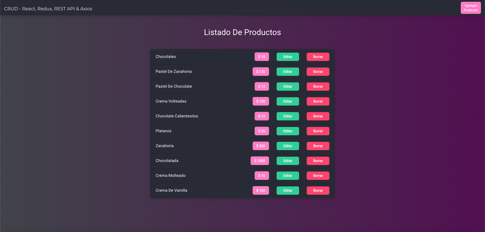
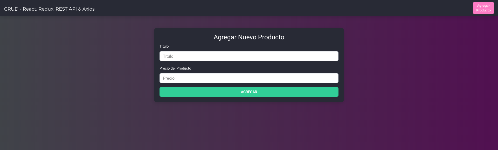
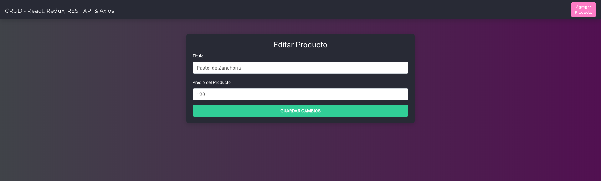

## Pasos para empezar

1: Abre el proyecto en tu editor  
2: Localizate en tu proyecto redux-crud  
3: Pon el comando npm install para instalar las dependencias.  

### `npm start`

Ya instaladas las dependencias escribe:  npm start

### Vista de todos los productos

 

 

### Vista para agregar un producto

 

 

### Vista para editar un producto

 

 
